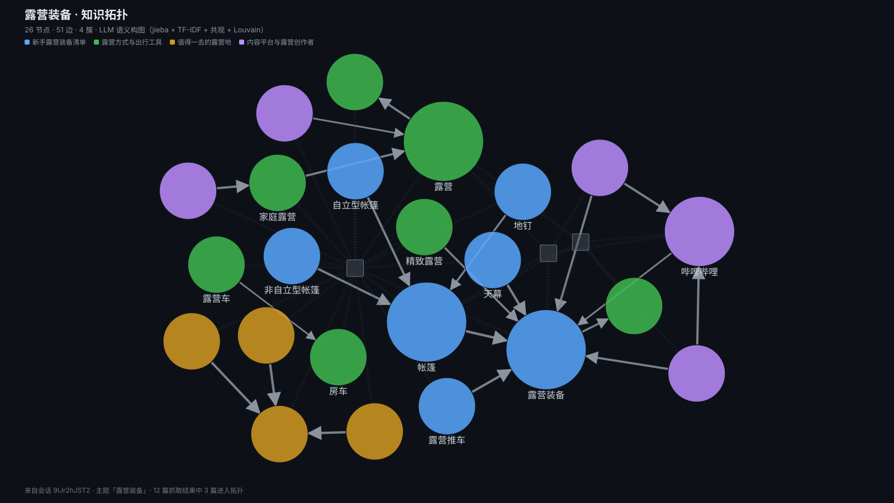

# muti-eye · 主题资源拓扑

输入一个主题，跨站点搜集资料 → 抓成正文 → 织成一张可交互的知识拓扑图 → 导出 Markdown 报告 → 把资料异步下载到本地。

```
主题「露营装备」
   ↓ 搜索      知乎 / B站 / YouTube / X / 全网（SearXNG，可选 Serper）
   ↓ 抓取      HTTP+Readability → 无头浏览器 → 站点专用接口（B站/YouTube）
   ↓ 构图      实体关系图，前端 Cytoscape + fcose 渲染
   ↓ 导出      按主题簇分章的 Markdown，含 Mermaid 拓扑
   ↓ 下载      并发队列 + 断点续传，SSE 推进度
```

## 它长什么样



这张图**不是手画的示意图**，是跑出来的产物：主题「露营装备」，26 个节点
（23 个概念 + 3 篇资料）、51 条边、4 个簇，走的是 LLM 语义构图。它是
`GET /api/export/image?sessionId=…` 的输出 —— 也就是你在界面上点「导出」
会拿到的同一张图，配色和半径算法与前端共用 `core/graph/palette.ts` 和
`core/graph/geometry.ts`，所以图和界面永远长得一样。

图上能看出几件事：

- **圆圈是概念，方块是资料**。方块刻意不上簇的颜色：一份资料「属于哪个簇」
  本身就不成立，它跟每个方向都只是相关程度不同
- **带箭头的实线是 LLM 给的带谓词的边**（「配套使用」而不是「一起出现过」），
  虚线是统计共现，点线是「这篇资料提到了这个概念」
- **几个大圆是这个词在这批语料里的分量**（TF-IDF 聚合后开方压缩）

自己生成一张（需要一个已经建过拓扑的会话）：

```bash
pnpm example:image <sessionId>              # 默认写到 docs/topology-<id>.svg
pnpm example:image <sessionId> --out docs/my.svg --no-docs
```

## 快速开始

```bash
pnpm install

# 1. 起 SearXNG（搜索层的默认后端，免 key）
pnpm searxng:setup     # 首次：拉源码、建 venv、写入自定义 settings.yml
pnpm searxng:up

# 2. 起应用
pnpm dev               # http://localhost:3000
```

打开页面后访问 `/api/health` 可以看到每一项依赖的实时状态：

```bash
curl -s localhost:3000/api/health | jq '.checks[] | {id, ok, detail}'
```

页面顶部的搜索框输入主题，勾选站点，依次点**搜索 → 抓取正文 → 构建知识拓扑**。
每一步的产物都留在页面上，刷新后会自动接回上一次的会话。

## 验证

`examples/` 下有一个不依赖浏览器的全链路验证脚本 —— 把这五步走一遍并逐项断言：

```bash
pnpm example                                 # 搜索 → 抓取 → 构图 → 导出 → 下载
node examples/e2e.mjs --verbose --no-llm     # 想看每条流式事件、或跳过 LLM
pnpm example:graph <sessionId>               # 拓扑：分簇、每簇 top 词、簇内边
pnpm example:docs  <sessionId>               # 逐篇抓取结果与降级原因
```

它的重点不是「有没有报错」，而是**降级证据**：每个请求过的站点都有 provider
记录、每次降级都写明了原因、下载的文件真的落在 `assets/` 下且非空。详见
[examples/README.md](examples/README.md)。

## 配置

复制 `.env.example` 为 `.env.local`（已被 `.gitignore` 覆盖），按需填写。**全部可留空** —— 缺失的能力会自动降级，不会崩溃。

| 变量 | 默认 | 作用 |
|---|---|---|
| `SEARXNG_URL` | `http://localhost:8888` | 搜索层默认后端，免 key |
| `SERPER_API_KEY` | 空 | 商业搜索 API，填了优先于 SearXNG，失败自动降级 |
| `YTDLP_PATH` | 自动探测 | yt-dlp 可执行文件，用于 YouTube 搜索与字幕 |
| `LLM_API_KEY` | 空 | 语义构图的密钥。空则走本地启发式路径 |
| `LLM_BASE_URL` | `https://api.deepseek.com` | OpenAI 协议的端点 |
| `LLM_MODEL` | `deepseek-flash` | 模型名 |
| `LLM_MAX_TOKENS` | `32768` | 输出上限，见下方「推理模型」一节 |
| `LLM_TIMEOUT_MS` | `300000` | 单次 LLM 请求超时 |
| `FETCH_PROXY_URL` | `http://127.0.0.1:6666` | 抓取/下载走的代理（**只对境外站点生效**，国内站点自动直连） |
| `PLAYWRIGHT_MODE` | `on-demand` | 无头浏览器降级：`off` / `on-demand`（仅 JS 空壳页）/ `always`（每篇都渲染） |
| `PLAYWRIGHT_MAX_PAGES_PER_RUN` | `8` | 一轮抓取最多用几次无头浏览器，超额不静默丢弃 |
| `FETCH_TIMEOUT_MS` / `FETCH_MAX_BYTES` | 15s / 5MB | 单页抓取的上限 |
| `DOWNLOAD_CONCURRENCY` | `3` | 下载队列并发 |

### LLM 构图是可选的

不配 `LLM_API_KEY` 也完全可用：本地启发式路径（jieba 分词 + TF-IDF + 共现 + Louvain 社区发现）会顶上，`generatedBy` 标记为 `heuristic`。两条路径产出**同一个 `GraphModel`** —— 前端、导出、下载都不需要知道这次是谁构的图。

配了 key 之后，LLM 路径做的是统计做不到的三件事：抽**实体**而不是词（「Mavic 3」不再被切成 Mavic + 3）、给出**带谓词的边**（「配套使用」而不是「一起出现过」）、以及**能直接当章节标题的簇名**加一句话综述。

任何失败（限流 / 超时 / key 无效 / 返回的 JSON 不合形状）都会**自动降级回启发式**，并把分类过的原因写进 `stats.llmFallbackReason`，界面上以「已降级」徽标呈现 —— 你拿到的一定是一张图，但你会知道这张是统计图。

**推理模型注意**：`deepseek-flash` 会先输出思维链，思维链和正文共享 `max_tokens`。额度给小了会出现「正文为空、`finish_reason=length`」这种看起来像模型哑了的现象。默认给到 32768 就是为了这个。

## 它是怎么拿到内容的

### 搜索层：靠 `site:` 定向，不碰平台鉴权

各平台的开放接口要么没有（知乎、小红书），要么按量计费（X）、要么免费额度只够每天 100 次（YouTube）。所以这里走的是**搜索引擎做发现层 + 站点适配器做深挖**：用 `site:zhihu.com <主题>` 这类定向语法让搜索引擎替我们完成跨站检索，完全不需要碰各平台的签名与登录态。

`SearchProvider` 适配器按链降级：`Serper? → SearXNG → yt-dlp（YouTube 专用）`。

### 抓取层：先分派「视频还是图文」，再分级降级

第一步是**按 URL 路径**判类型（`src/core/kind.ts`），而不是按站点 —— 因为 B 站的专栏（`/read/`）和图文（`/opus/`）抓到的是**真正文**，按站点判会把它们当成视频，于是去给一篇没有播放器的文章找字幕、排媒体下载、并放进包里的 `视频/`。

| 分派 | 级别 | 手段 | 适用 |
|---|---|---|---|
| 视频 | 1 | yt-dlp 字幕 | YouTube —— 视频的「正文」就是字幕 |
| 视频 | 2 | B站公开接口 | B站视频：标题 / UP主 / 分区 / 标签 / 简介 / 字幕 |
| 图文 | 3 | B站公开接口 | B站专栏 `/read/`、图文 `/opus/` |
| 图文 | 4 | HTTP + Readability | 大部分博客、新闻、专栏 |
| 图文 | 5 | Playwright 无头浏览器 | JS 空壳站点（需 `PLAYWRIGHT_MODE=on-demand`） |
| 共同 | 6 | 兜底 | 退化为搜索摘要，`extractMethod: "raw"` |

类型判据是 `site + url` 的纯函数，**不读落库的 `kind` 字段**（那只是抓取那一刻的快照，判据一改就过期）。凡是要据此做决定的地方都走 `docKind()` 现算。

**单篇失败不抛异常**，只产出带 `error` 的 Document —— 一个主题下几十篇资料，其中几篇抓不到是常态（站点下线、反爬拦截、内容被删），不该让整批失败。

两条站点专用通道值得单说，因为**页面抓取在这两家产出的是垃圾而不是内容**：

- **YouTube**：观看页 HTML 里没有正文，只有 `var ytInitialPlayerResponse = {...}`。Readability 会把它当正文抓出几万字的 JS 源码，比抓不到还糟。
- **B站**：页面抓出来的是站内导航 + 侧栏的「接下来播放」推荐列表 —— 一千多字里没有一个是这个视频的内容，而几十篇这样的资料叠在一起，TF-IDF 里「首页/番剧/会员购/点赞」的权重会高到离谱。

B站通道走 `api.bilibili.com` 的公开接口，**不需要登录、不需要签名**（wbi 签名是给播放地址那类接口用的，元数据接口不用）。它返回的是视频自己的东西；视频被删除时也会明确告诉你 `code=62002 稿件不可见`，而不是给你一段别人的视频标题。

## 目录结构

```
src/
├─ app/
│  ├─ page.tsx                主界面：搜索 → 抓取 → 构图 → 下载
│  ├─ globals.css
│  └─ api/
│     ├─ health/route.ts      各依赖可用性 + 修复建议
│     ├─ search/route.ts      POST 主题 → SSE 流式回传搜索结果
│     ├─ fetch/route.ts       POST → SSE 逐篇回传正文
│     ├─ graph/route.ts       POST 结果集 → GraphModel
│     ├─ export/route.ts      GET → report.md
│     ├─ export/image/route.ts GET → 拓扑图 SVG
│     ├─ download/route.ts    POST 建任务 / GET SSE 进度
│     └─ session/route.ts     GET 取回会话 / POST 存图的布局（刷新页面后接着用）
├─ core/
│  ├─ types.ts                ★ 全局契约，其余模块都围绕它编程
│  ├─ env.ts                  配置与可用性探测
│  ├─ store.ts                会话落盘（文件系统，无数据库）
│  ├─ limit.ts                并发闸 + 退避重试
│  ├─ search/                 provider / searxng / serper / ytdlp / sites
│  ├─ fetch/                  extract（降级链）/ http / agent（代理）/ readability
│  │                          / playwright / youtube / bilibili
│  │                          / limitations（已知站点限制的翻译规则）
│  ├─ graph/                  build（统一入口）/ heuristic / llm / tokenize / communities
│  │                          / palette（配色唯一来源）/ geometry（尺寸唯一来源）
│  ├─ export/                 markdown.ts（报告）/ svg.ts（拓扑图）
│  └─ download/               queue（状态机）/ kinds（各类资源的下载器）
└─ components/
   ├─ graph/                  GraphView / GraphToolbar / GraphTooltip / GraphLegend
   └─ SearchPanel / NodeDetail / DownloadPanel / postSse

examples/
├─ e2e.mjs                    全链路验证：断言的 8 步
├─ show.mjs                   读会话产物，在终端里看拓扑/抓取质量/报告
├─ graph-image.mjs            调导出接口，把拓扑图写成 SVG
└─ README.md                  验证什么、怎么判定「降级」和「失败」

docs/topology-example.svg     README 里那张示例图（由真实会话生成，可复现）

data/sessions/<id>/           运行时产物（gitignore）
├─ session.json               主题、结果、正文、图
├─ report.md                  导出的报告
└─ assets/                    下载的资料（含 .done 完成标记）
```

**核心设计原则**：所有模块围绕 `src/core/types.ts` 里的契约编程。搜索层、抓取层、图构建层各自可独立替换，前端只认 `GraphModel`。这也是启发式与 LLM 两条路径能无缝共存的原因。

## 下载

`queue.ts` 是一个带状态机的并发队列，任务落盘在 `data/sessions/<id>/tasks.json`：

- **进程重启能续跑**，已完成的任务按文件存在性跳过（目录类任务看 `.done` 标记）
- **断点续传**：HTTP Range，206 就接着写，200 就从头来
- **原子落盘**：先写 `.part` 再 rename，中途断掉不会留下半个文件
- **低速看门狗**：60 秒内不足 8 KB 就掐断并重试 —— 实测遇到过一个 275 B/s 的挂死连接，没有看门狗它会一直挂着
- **暂停 / 继续 / 取消 / 重试**，进度经 SSE 推给前端

下载任务在服务端自己跑，与浏览器无关。刷新页面后前端会从 `localStorage` 取回上次的会话 id，重新接上那个任务。

## 明确不做

- **不逆向知乎/小红书的签名算法，不碰登录态**（CDP 复用 Chrome 登录状态）—— 合规风险不可控
- 不做用户系统、数据库（文件系统存会话够了）
- 不做分布式/多机 —— 单机个人工具

## 已知限制

这一节说的每一件事，**在报告和下载包里都会自己说出来**：报告的「站点抓取局限」一节列出本次
受限的站点和原因，`未收录.md` 把这一类排在最前面并标注「不是故障」。翻译规则在
`src/core/fetch/limitations.ts` —— 只有**站点 + 特征同时命中**才认，认不出的（B站 500、
知乎超时）一律保留原始错误，不粉饰成平台限制。

| 现象 | 原因 |
|---|---|
| 知乎返回 403 | 未登录的游客访问被拦，需要 `zh-zse-ck` 签名。直连和走代理都一样，不是代理问题 |
| 小红书、X 搜索结果为空 | 站内内容不被搜索引擎索引 |
| B站视频只有标题和标签 | 该视频没有 CC 字幕、简介也是空的。接口已尽力，比拿推荐列表冒充正文诚实 |
| 覆盖率不高的中文长尾站点 | 没装 Playwright 时只能拿到静态 HTML。`/api/health` 会区分「已关闭」和「已启用但未安装」——两者都不是故障，是配置 |
| 一篇 SPA 站点没被渲染 | 本轮的无头浏览器配额（默认 8 页）用完了。这一条会写进该篇的 `error`，不会静默降级 |

## 常用命令

```bash
pnpm dev            # 开发服务器
pnpm build          # 生产构建
pnpm typecheck      # tsc --noEmit

pnpm example        # 全链路验证（需 dev 已启动）
pnpm example:graph  # 看某次会话的拓扑
pnpm example:docs   # 看某次会话的抓取质量
pnpm example:report # 看某次会话的 Markdown 报告
pnpm example:image  # 把某次会话的拓扑导出成 SVG

pnpm searxng:setup  # 首次安装 SearXNG（源码 + venv + settings）
pnpm searxng:up     # 启动
pnpm searxng:down   # 停止
pnpm searxng:status # 状态
pnpm searxng:logs   # 日志
pnpm searxng:docker # 或改用 docker compose

pnpm ytdlp:fetch    # 下载 yt-dlp 单文件二进制到 bin/
```
